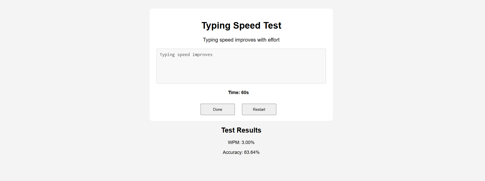

# 🖹 Typing Speed Test
Test how fast your fingers fly on the keyboard ⌨️

This is a simple web app built using HTML, CSS, and JavaScript that lets you check your typing speed in words per minute (WPM) and accuracy.

## 🚀 Features
- Random sentence generator

- Real-time WPM and accuracy tracking

- Timer starts when you begin typing

- Reset button to try again

- Clean and responsive UI

## 📸 Preview

## 🛠️ Tech Stack
- HTML5 for structure

- CSS3 for styling

- JavaScript (vanilla) for interactivity
